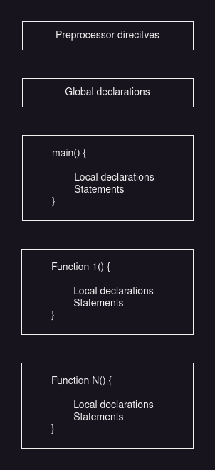

# Introduction

- C was developed by Dennis Ritchie at Bell Laboratories to be used by the UNIX OS.
- It was designed to implement system software and later was widely used for developing portable software.
- Very popular languages like C++ and Java are based on C.
- C and UNIX are strongly associated with each other as both were developed at Bell Labs.
- A standard version of C was made by American National Standard Institute (ANSI) and later it was named as ANSI C.
- Later new versions of ANSI C emerged with improvements and new features and were called C95 and C99.

# Characteristics of C language

- Robust language with rich set of built-funtions to write complex programs.
- The C compiler combines the features of assembly language and high-level language.
- It is a high-level programming language.
- Has only 32 keywords.
- Makes extensive use of function calls.
- Well suited for structured programming.
- Supports loose typing which means a character can be treated as an integer and vice versa.
- Structured language, fast and efficient, well written language.
- Facilitates low level programming using bitwise operators.
- Has pointers support.
- It is the core of many modern languages like C++, Java, Python, etc.
- Their compilers and interpreters are written in C.
- Portable language which means program written on one machine can be executed on another with little or no modifications.
- Enables user to add their own functions to C library.
- C is often treated as the second best language for any programming task, while the best language depends on the particular task to be performed.

# Structure of C program

- `Preprocessor Directives` - Contains special instructions that indicates how to prepare the program for compilation. One of the commonly used is `include`.
